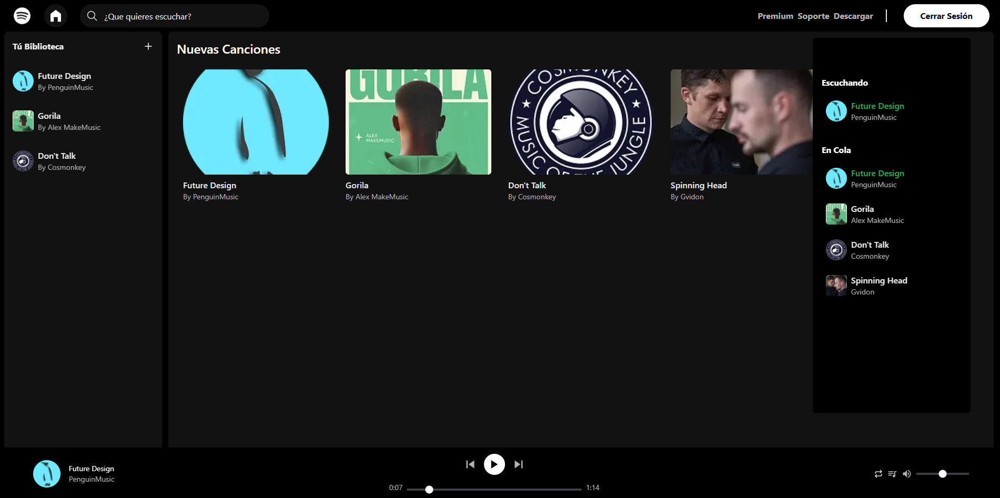

# 🎵 Music Streaming App (Spotify Clone)

Personal project for a music streaming platform similar to Spotify.
It includes user authentication, playlist management, and a built-in music player.

## 🖼️ Preview

## ✨ Features

- 🔑 User registration and login 
- 🎶 Song playback with controls
- 📤 Upload songs 
- 📱 Responsive design  

## 🛠️ Technologies

- **Frontend:** React / Next.js, TailwindCSS  
- **Backend:** Node.js, Supabase 
- **Database:** Supabase (PostgreSQL)

## 🌐 Demo

👉 [Test here](https://music-streaming-website-lucas.vercel.app/)
